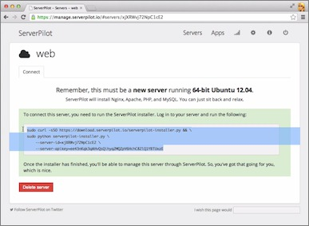
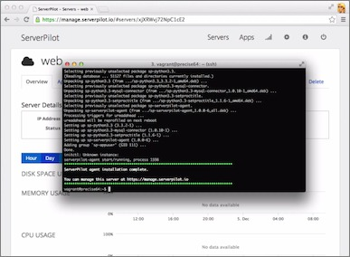
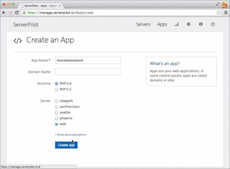
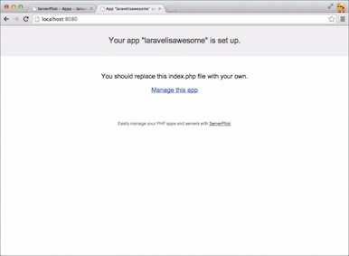

===========
This repo provides a sample Vagrantfile to create a 64-bit Ubuntu 12.04 virtual machine. After following the installation instructions, you'll have a server that you can manage with ServerPilot.

http://www.youtube.com/watch?v=n1qdvBY5WM8

https://serverpilot.io


Getting Started
---------------
1. Install dependencies
  * [Virtualbox](https://www.virtualbox.org/) 4.0 or greater.
  * [Vagrant](http://downloads.vagrantup.com/) 1.3.1 or greater.
2. Clone this repo and get the VM up and running!

```bash
$ git clone https://github.com/ServerPilot/Vagrantfile.git
$ cd Vagrantfile
$ vagrant up
$ vagrant ssh
```

Connecting to ServerPilot
-------------------------
  * [Log in](https://manage.serverpilot.io/#login) to ServerPilot
  * Go to the *Servers* page and click **+ Connect Server**
  * Give your server a name
  * Copy the *whole* command



  * Paste the command in the VM shell and watch ServerPilot install



<!--2. Go to the *Servers* page and click -->
<!--2. Go to the *Servers* page and click -->

Create Your First App
---------------------
  * Go to the *Apps* page and click **+ Create App**
  * Give your App a name and choose the server you just created



  * Go to [localhost:8080](http://localhost:8080) in a new tab and you should see the ServerPilot splash page



**Not seeing the splash page?** ServerPilot may still be installing packages on your server. Wait 60 seconds and refresh the page. This delay will only happen once, when you install ServerPilot initially.

Use Composer to Create a Laravel App
--------------------------------------
Switch to the `serverpilot` user

```bash
$ sudo -i
$ su serverpilot
$ cd ~/apps/APPNAME
```

Initialize a Laravel app with Composer (see the [Laravel Quickstart](http://laravel.com/docs/quick))

```bash
$ rm -rf public
$ composer5.4-sp create-project laravel/laravel . --prefer-dist
```

When Composer is done, refresh [localhost:8080](http://localhost:8080) and you should see the Laravel splash page!


What Next?
----------
  * Follow ServerPilot on [Twitter](https://twitter.com/ServerPilot) and [Google+](https://plus.google.com/101788046220648674233)
  * Watch other screencasts on [YouTube](http://www.youtube.com/channel/UC6eB3T3oRB0_gq3tKVmRDqQ)
  * Send us feedback and suggestions at [support@serverpilot.io](mailto:support@serverpilot.io)

